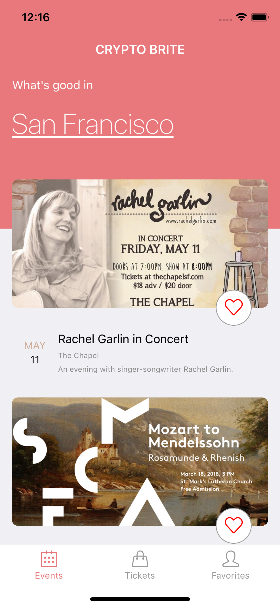
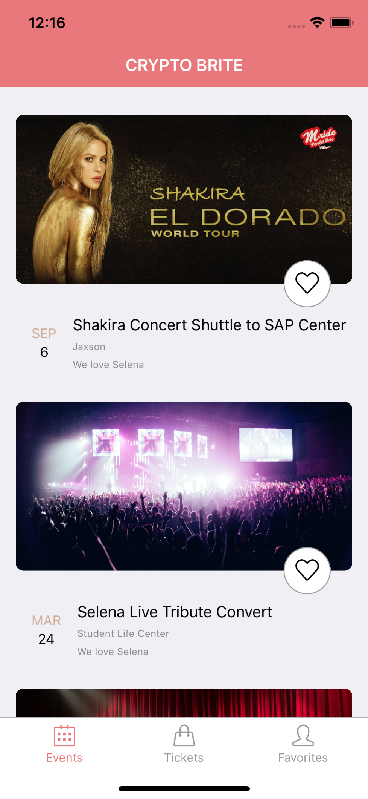
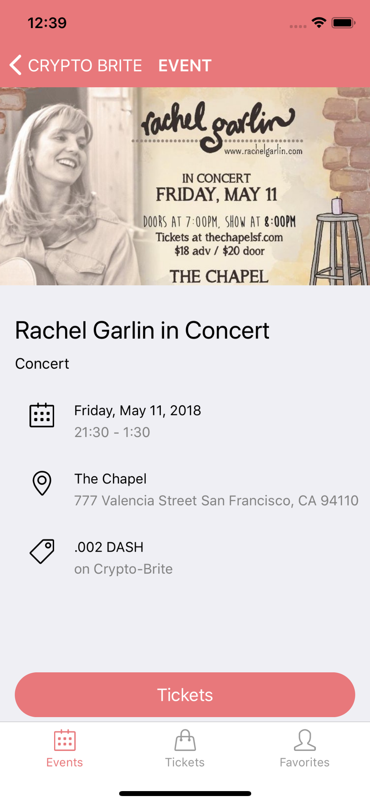
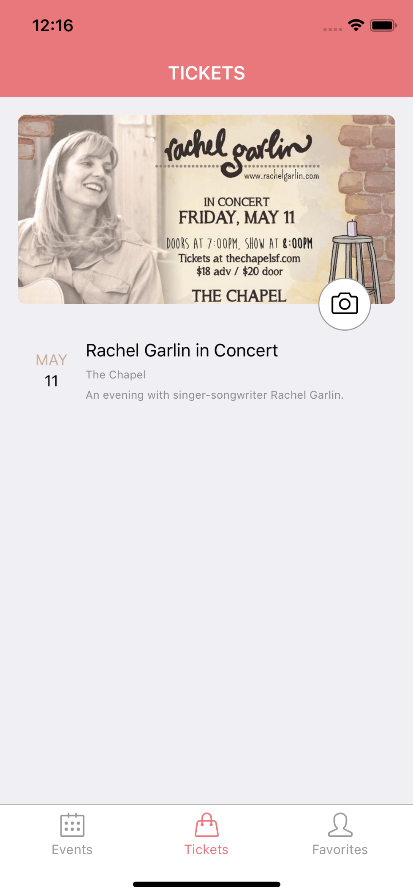
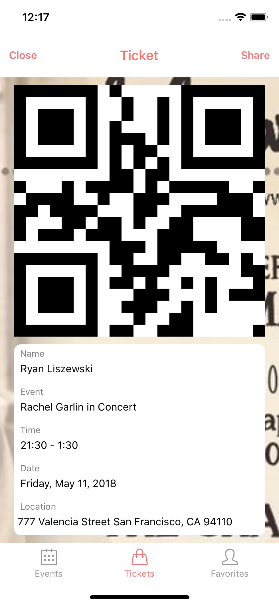
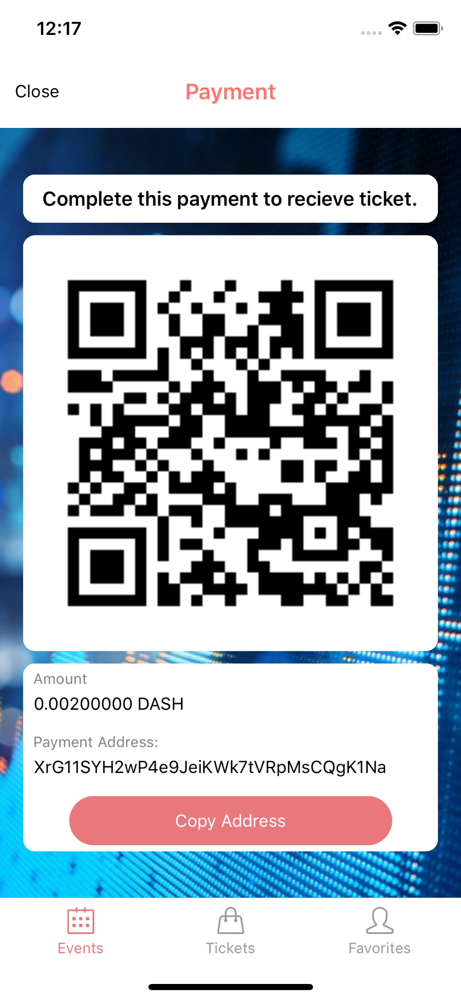

## CryptoBrite 

#### _CryptoBrite is a cross platform app written in React Native for SFHacks 2018. It allows users to buy tickets to events with the crypto currencies, including Dash._  

## Mission Statement  
 What if you could browse event, like a party, and purchase spots through cryptocurrency with the ease of your smartphone? No more forgetting tickets or losing tickets and worrying about getting into your next new hot event. 
 
Our team has two applications written for both android and iOS mobile application called CryptoBrite. Dual platform and functionality is done through writing the applications in React Native. The first application displays different events like, concerts, that can be purchased through cryptocurrency with the help of coin payments api. Once purchased through coin payments you are then given a QR code as your ticket which can be scanned by our second application to validate the QR code ticket. 

Our first application would be helpful for people to easily purchase tickets to an event with the connivence of their smartphone and our second application would be helpful for the event organizers.


## Team 

 

We all have started learning React Native together at [MobileSpace Season 2](https://github.com/mobilespace/Season2) during the Spring Semester of 2018. We wanted to use SFHacks 2018 as a place to test our newly aquired React Native skills to hack together an awesome app. 

### Thomas Zhu - _Front End_ 
<a href="https://github.com/thomashzhu"></a>
<a href="https://www.linkedin.com/in/thomashzhu/"></a>


### Ryan Liszewski - _Full Stack_ 
<a href="https://github.com/ryanliszewski"></a>
<a href="https://www.linkedin.com/in/ryanliszewski/"></a>


### Nicholas Szeto - _Front End_ 
<a href="https://github.com/niszeto"></a>
<a href="https://www.linkedin.com/in/thomashzhu/"></a>

### Sukhjit Singh - _Full Stack_
<a href="https://github.com/sukhjitsingh"></a>
<a href="https://www.linkedin.com/in/iamsukhjitsingh/"></a>

## Prizes

### 1. Best Mobile App
### 2. Best Beginner Hack
### 3. Best use of the Dash API


## Getting Started

1. Download expo on your phone. 
2. Go to this [expo link](https://expo.io/@thomashzhu/crypto-brite) and scan the qr code. 

#### For developers: 
```
git clone git@github.com:thomashzhu/crypto-brite

exp start 

exp ios (iOS version) 

exp android (Andriod version) 

```

## API

#### Using the [Dash Platform](Dash.org) and [CoinPayments](https://www.coinpayments.net/), we created an API that can process Dash payments and other crypto currencies as well. The API was developed with *Node.js* and *Express.js*. 

[Repository Link](https://github.com/sukhjitsingh/brite-payment)


## Screen Shots (iOS)

### *Launch Screen + Logo*
<div style={{display: flex; flex-direction: row}}>
  
  
</div>

### *Events Screen:* 

<div style={{display: flex; flex-direction: row}}>
  
  
  
</div>

### *Event Detaill Scren*
<div style={{display: flex; flex-direction: row}}>
	
</div>


### *Tickets + Favorites Screen:* 

<div style={{display: flex; flex-direction: row}}>
  
  
</div>

### *Ticket + Payment Screen* 

<div style={{display: flex; flex-direction: row;}}>
  
  
</div>


